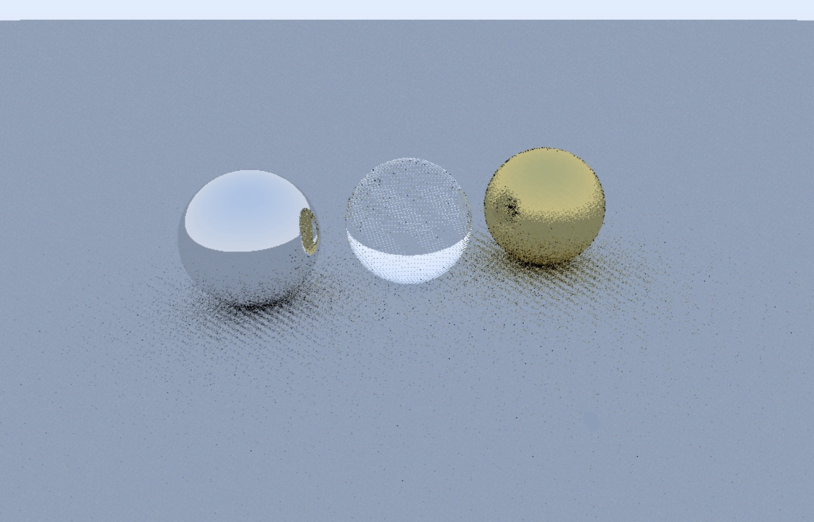

# Real-Time Hybrid CPU+GPU Ray Tracer in OpenGL (No RTX Required)

**Photorealistic real-time ray/path tracer** implemented from scratch in C++ and GLSL — no RTX, no Vulkan, no proprietary APIs.
This project demonstrates a hybrid rendering pipeline where the **CPU prepares the scene** and the **GPU performs physically-based path tracing** entirely in a fragment shader via **OpenGL 4.3 Shader Storage Buffer Objects (SSBOs).** A compute shader backend was also prototyped and tested successfully, offering potential performance gains on compatible hardware, but the code for that version was lost during development iterations. Recreating it is straightforward and is currently in progress as a work-in-progress feature.

⚡ Runs even on modest hardware — tested on **ARM Mali GPUs** and **Android smartphones** with desktop **Linux** (Termux + X11).


## ✨ Features

* **Hybrid architecture** — CPU handles scene setup, GPU executes path tracing.
  
* **Two rendering backends** (fragment shader is fully implemented; compute shader is WIP):
    - **Fragment shader** path tracer (full-screen quad).
    - **Compute shader** implementation (tested previously, being recreated for flexibility and optimization).

* **Physically based materials**:
    - Lambertian diffuse
    - Metal with roughness
    - Glass with Fresnel reflections and refraction
    - Emissive light sources

* **Real-time path tracing** with up to 8 bounces.

* **SSBO-based** scene storage (virtually unlimited objects/materials).

* Gradient sky background for natural lighting.

* Camera orbit animation around the scene.

* Gamma correction for display-ready output.


## 📷 Screenshots

Without denoiser (noisy output at low sample counts): 

With experimental denoiser (early prototype, not included in source). This shows excellent noise reduction even on minimum RT settings (e.g., low samples per pixel), resulting in smooth, photorealistic results in real-time. This is just version 1 of the denoiser — future iterations will improve artifact handling and performance further:

## 🛠 Technical Overview
The **CPU side**:
- Defines scene geometry and materials (`Sphere`, `Plane` classes).
- Prepares GPU-ready structures and uploads them to SSBOs.
- Updates camera position and view matrix every frame.

The **GPU side** (fragment shader, with compute shader):
- Casts a ray from the camera for each pixel.
- Intersects rays with all scene objects (spheres, planes).
- Applies material logic: reflection, refraction, diffuse scattering.
- Combines emitted and reflected light for final pixel color.
- Outputs tone-mapped, gamma-corrected image.

Rendering is done entirely on a fullscreen quad (fragment shader) or via dispatched compute groups (compute shader)

No rasterization of 3D meshes — the screen is a full-screen quad, and every pixel is computed by tracing rays.


## 📋 Hardware & Environment
This project was written, compiled, and run **entirely on a rugged Android smartphone** in a full Linux desktop environment.

- **CPU:** MediaTek Helio P70 (8 cores)
- **RAM:** 4 GB LPDDR4
- **GPU:** ARM Mali-G72 MP3
- **OS:** Android 9 with Termux + X11 + Debian Linux (XFCE4 desktop)

> No discrete GPU. No NVIDIA RTX. No problem.


## 🚀 Build & Run
**Dependencies:**
- OpenGL 4.3+
- GLEW
- SDL2
- GLM
- g++ or clang++

**On Debian/Ubuntu:**
```bash
sudo apt install g++ libglew-dev libsdl2-dev libglm-dev
g++ main.cpp -lGLEW -lSDL2 -lGL -std=c++17 -o raytracer
./raytracer
```


### 🧪 Experimental Denoiser
A custom **denoising system** has been prototyped, combining temporal accumulation and spatial filtering.
* Significantly reduces noise at low sample counts, delivering clean images even on minimal ray tracing settings.
* Fully implemented in **GLSL**, compatible with **OpenGL 4.3** and both **fragment/compute shader** pipelines.
* Achieves impressive results in real-time, as shown in the screenshot above — smooth spheres with minimal artifacts, far superior to raw noisy output.
* Still under active development, with this being just the first version. Expect enhancements for better edge preservation and motion handling.

 ⚠️ Note: The **denoiser** code is not included in this repository to keep it as my own development. Current release provides only the base path tracer. If you’re interested in collaborating or have ideas, feel free to open an issue!


## 📄 License This project is released under the **MIT License**.

The experimental denoiser is proprietary and not included in this repository.
